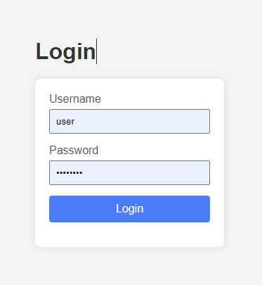

# Web開発ポートフォリオサンプル Java
Web開発のポートフォリオを作成するためのサンプルコードです。

## 説明
- ポートフォリオ開発を素早く開始できることを目的としています。
- フレームワークはSpring Bootを使用しています。
- Dockerfileを用意しているため、本番環境へのデプロイが容易です。
- Visual Studio Code上での開発を想定しています。
- Ubuntu 22.04.4 LTSで動作を確認しています。

## 事前準備
1. java17インストール
    ```bash
    sudo apt-get update
    sudo apt-get install openjdk-17-jdk
    ```
2. 本リポジトリをcloneする
    ```bash
    git clone https://github.com/otokawa-tatsumi/portfolio_sample_java.git
    ```
3. vscodeでワークスペースを開く
    - ファイル -> ファイルでワークスペースを開く -> .vscode/portfolio_sample_java.code-workspaceを選択
4. vscodeに以下の拡張機能をインストール
    - Extension Pack for Java
    - Spring Boot Extension Pack

## 開発方法
1. 開発用DBの開始
    ```bash
    make up-db
    ```
2. ソースファイルの編集
    - ```sample/src/```以下にソースファイルがある
2. デバッグ方法
    - f5キーもしくはvscodeの左メニューの「実行とデバッグ」より実行
3. Webページのアクセス方法
    - http://localhost:8080/sample/login にアクセスし、以下の情報でログインする
        - ユーザー：user
        - パスワード：password

        
4. DBの参照方法
    - http://localhost:8080/db-manager/ にアクセスし、以下の情報でログインする(pgadmin 4)
        - ユーザー：admin@pgadmin.org
        - パスワード：admin

        
5. 開発用DBの終了
    ```bash
    make down-db
    # DBを初期化したい場合は以下
    make down-db OPTION=-v
    ```

## 本番デプロイ方法
1. 公開用サーバーに本リポジトリをcloneする
2. 以下のコマンドを実行
    ```bash
    make up
    ```
3. 以下のコマンドでサービスが起動しているか確認
    ```bash
    make status
    make log
    ```
4. 終了する時は以下のコマンドを実行する
    ```bash
    make down
    ```
